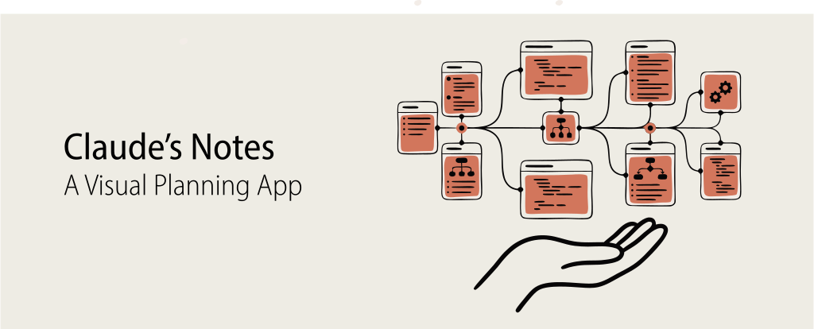

# Claude's Notes

<p align="center">
  
</p>

<p align="center">
  <strong>A visual planning interface for Claude Code</strong>
</p>

<p align="center">
  Plan features, review proposed changes, and manage coding sessions with a rich web UI that wraps the Claude Code CLI.
</p>

---

## Features

- **Visual Planning** - Create and manage implementation plans with a structured task breakdown
- **Real-time Streaming** - Watch Claude's thinking and responses as they happen via SSE
- **Session Management** - Save, resume, and organize your planning sessions
- **Plan Approval Workflow** - Review and approve plans before execution
- **Dark/Light Mode** - Comfortable viewing in any environment
- **Local-first** - All data stays on your machine, no cloud storage

## How It Works

Claude's Notes does NOT call the Claude API directly. It spawns the locally installed `claude` CLI as a subprocess and streams its output to the browser.

```
Browser → Next.js API → Claude CLI subprocess → SSE → Browser
```

This approach means:
- **No API keys needed in the web app** - Claude CLI handles authentication
- **Full CLI capabilities** - Access all Claude Code features
- **Privacy** - Your code and conversations stay local

---

## Prerequisites

| Requirement | Description |
|------------|-------------|
| **Node.js 18+** | Required for Next.js server |
| **Claude Code CLI** | Must have `claude` CLI installed and authenticated locally |
| **PATH Access** | The `claude` binary must be accessible in your system PATH |

## Quick Start

```bash
# Clone the repository
git clone https://github.com/michaelshimeles/ralphy.git
cd ralphy/web

# Install dependencies
npm install

# Initialize the database
npm run db:migrate

# Start the app
npm run dev
```

The app will be available at `http://127.0.0.1:3000`

## Available Scripts

| Command | Description |
|---------|-------------|
| `npm run dev` | Start development server (localhost only) |
| `npm run build` | Build for production |
| `npm run start` | Start production server (localhost only) |
| `npm run test` | Run tests |
| `npm run test:watch` | Run tests in watch mode |
| `npm run db:migrate` | Run database migrations |
| `npm run db:studio` | Open Drizzle Studio to browse database |
| `npm run lint` | Run ESLint |

## Tech Stack

| Layer | Technology |
|-------|------------|
| Framework | Next.js 14 (App Router) |
| UI Components | shadcn/ui + Radix UI |
| Styling | Tailwind CSS |
| State Management | Zustand |
| Database | SQLite + Drizzle ORM |
| Streaming | Server-Sent Events (SSE) |

## Security

- Server binds to `127.0.0.1` (localhost) only - not accessible from other machines
- No API keys stored in the web app - Claude CLI manages authentication
- All AI requests go through the local CLI subprocess

---

# Ralphy CLI

[](https://www.npmjs.com/package/ralphy-cli)

Autonomous AI coding loop. Runs AI agents on tasks until done.

## Install

**Option A: [npm](https://www.npmjs.com/package/ralphy-cli)** (recommended)
```bash
npm install -g ralphy-cli

# Then use anywhere
ralphy "add login button"
ralphy --prd PRD.md
```

**Option B: Clone**
```bash
git clone https://github.com/michaelshimeles/ralphy.git
cd ralphy && chmod +x ralphy.sh

./ralphy.sh "add login button"
./ralphy.sh --prd PRD.md
```

Both versions have identical features. Examples below use `ralphy` (npm) - substitute `./ralphy.sh` if using the bash script.

## Two Modes

**Single task** - just tell it what to do:
```bash
ralphy "add dark mode"
ralphy "fix the auth bug"
```

**Task list** - work through a PRD:
```bash
ralphy              # uses PRD.md
ralphy --prd tasks.md
```

## Project Config

Optional. Stores rules the AI must follow.

```bash
ralphy --init              # auto-detects project settings
ralphy --config            # view config
ralphy --add-rule "use TypeScript strict mode"
```

Creates `.ralphy/config.yaml`:
```yaml
project:
  name: "my-app"
  language: "TypeScript"
  framework: "Next.js"

commands:
  test: "npm test"
  lint: "npm run lint"
  build: "npm run build"

rules:
  - "use server actions not API routes"
  - "follow error pattern in src/utils/errors.ts"

boundaries:
  never_touch:
    - "src/legacy/**"
    - "*.lock"
```

Rules apply to all tasks (single or PRD).

## AI Engines

```bash
ralphy              # Claude Code (default)
ralphy --opencode   # OpenCode
ralphy --cursor     # Cursor
ralphy --codex      # Codex
ralphy --qwen       # Qwen-Code
ralphy --droid      # Factory Droid
```

## Task Sources

**Markdown** (default):
```bash
ralphy --prd PRD.md
```
```markdown
## Tasks
- [ ] create auth
- [ ] add dashboard
- [x] done task (skipped)
```

**YAML**:
```bash
ralphy --yaml tasks.yaml
```
```yaml
tasks:
  - title: create auth
    completed: false
  - title: add dashboard
    completed: false
```

**GitHub Issues**:
```bash
ralphy --github owner/repo
ralphy --github owner/repo --github-label "ready"
```

## Parallel Execution

```bash
ralphy --parallel                  # 3 agents default
ralphy --parallel --max-parallel 5 # 5 agents
```

Each agent gets isolated worktree + branch:
```
Agent 1 → /tmp/xxx/agent-1 → ralphy/agent-1-create-auth
Agent 2 → /tmp/xxx/agent-2 → ralphy/agent-2-add-dashboard
Agent 3 → /tmp/xxx/agent-3 → ralphy/agent-3-build-api
```

Without `--create-pr`: auto-merges back, AI resolves conflicts.
With `--create-pr`: keeps branches, creates PRs.

**YAML parallel groups** - control execution order:
```yaml
tasks:
  - title: Create User model
    parallel_group: 1
  - title: Create Post model
    parallel_group: 1  # same group = runs together
  - title: Add relationships
    parallel_group: 2  # runs after group 1
```

## Branch Workflow

```bash
ralphy --branch-per-task                # branch per task
ralphy --branch-per-task --create-pr    # + create PRs
ralphy --branch-per-task --draft-pr     # + draft PRs
ralphy --base-branch main               # branch from main
```

Branch naming: `ralphy/<task-slug>`

## Browser Automation

Ralphy can use [agent-browser](https://agent-browser.dev) to automate browser interactions during tasks.

```bash
ralphy "test the login flow" --browser    # force enable
ralphy "add checkout" --no-browser        # force disable
ralphy "build feature"                    # auto-detect (default)
```

When enabled, the AI gets browser commands:
- `agent-browser open <url>` - navigate to URL
- `agent-browser snapshot` - get element refs (@e1, @e2)
- `agent-browser click @e1` - click element
- `agent-browser type @e1 "text"` - type into input
- `agent-browser screenshot <file>` - capture screenshot

**Use cases:**
- Testing UI after implementing features
- Verifying deployments
- Form filling and workflow testing

**Config** (`.ralphy/config.yaml`):
```yaml
capabilities:
  browser: "auto"  # "auto", "true", or "false"
```

## CLI Options

| Flag | What it does |
|------|--------------|
| `--prd FILE` | task file (default: PRD.md) |
| `--yaml FILE` | YAML task file |
| `--github REPO` | use GitHub issues |
| `--github-label TAG` | filter issues by label |
| `--parallel` | run parallel |
| `--max-parallel N` | max agents (default: 3) |
| `--branch-per-task` | branch per task |
| `--base-branch NAME` | base branch |
| `--create-pr` | create PRs |
| `--draft-pr` | draft PRs |
| `--no-tests` | skip tests |
| `--no-lint` | skip lint |
| `--fast` | skip tests + lint |
| `--no-commit` | don't auto-commit |
| `--max-iterations N` | stop after N tasks |
| `--max-retries N` | retries per task (default: 3) |
| `--retry-delay N` | seconds between retries |
| `--dry-run` | preview only |
| `--browser` | enable browser automation |
| `--no-browser` | disable browser automation |
| `-v, --verbose` | debug output |
| `--init` | setup .ralphy/ config |
| `--config` | show config |
| `--add-rule "rule"` | add rule to config |

## Requirements

**Required:**
- AI CLI: [Claude Code](https://github.com/anthropics/claude-code), [OpenCode](https://opencode.ai/docs/), [Cursor](https://cursor.com), Codex, Qwen-Code, or [Factory Droid](https://docs.factory.ai/cli/getting-started/quickstart)

**npm version (`ralphy-cli`):**
- Node.js 18+ or Bun

**Bash version (`ralphy.sh`):**
- `jq`
- `yq` (optional, for YAML tasks)
- `bc` (optional, for cost calc)

**Both versions:**
- `gh` (optional, for GitHub issues / `--create-pr`)
- [agent-browser](https://agent-browser.dev) (optional, for `--browser`)

## Engine Details

| Engine | CLI | Permissions | Output |
|--------|-----|-------------|--------|
| Claude | `claude` | `--dangerously-skip-permissions` | tokens + cost |
| OpenCode | `opencode` | `full-auto` | tokens + cost |
| Codex | `codex` | N/A | tokens |
| Cursor | `agent` | `--force` | duration |
| Qwen | `qwen` | `--approval-mode yolo` | tokens |
| Droid | `droid exec` | `--auto medium` | duration |

---

## Changelog

### v4.2.0
- browser automation: `--browser` / `--no-browser` with [agent-browser](https://agent-browser.dev)
- auto-detects agent-browser when available
- config option: `capabilities.browser` in `.ralphy/config.yaml`

### v4.1.0
- TypeScript CLI: `npm install -g ralphy-cli`
- cross-platform binaries (macOS, Linux, Windows)
- no dependencies on jq/yq/bc for npm version

### v4.0.0
- single-task mode: `ralphy "task"` without PRD
- project config: `--init` creates `.ralphy/` with rules + auto-detection
- new: `--config`, `--add-rule`, `--no-commit`

### v3.3.0
- Factory Droid support (`--droid`)

### v3.2.0
- Qwen-Code support (`--qwen`)

### v3.1.0
- Cursor support (`--cursor`)
- better task verification

### v3.0.0
- parallel execution with worktrees
- branch-per-task + auto-PR
- YAML + GitHub Issues sources
- parallel groups

### v2.0.0
- OpenCode support
- retry logic
- `--max-iterations`, `--dry-run`

### v1.0.0
- initial release

## Community

- [Discord](https://rasmic.link/discord)

## License

MIT
